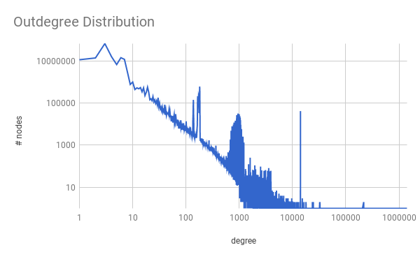
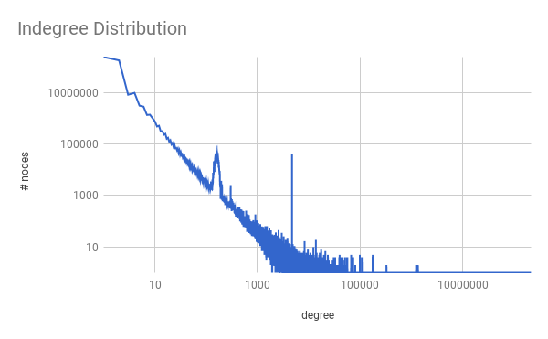

#  Introduction

This report was made for my Big Data Computing Exam, held by [Prof. Irene Finocchi](http://wwwusers.di.uniroma1.it/~finocchi/). 

The original Homework statement can be found [here](http://twiki.di.uniroma1.it/pub/BDC/WebHome/BigData-hw1-aa2016-2017.pdf).

We were asked to do an analysis on a large RDF graph, called the [Billion Triple Dataset](http://km.aifb.kit.edu/projects/btc-2010/). In order to carry out the analysis, we had to study some MapReduce algorithm and their implementation.

While some tasks were based on widely used M/R patterns, the design and analysis on dataset of this size can be 


## The development environemnt

To develop this project, I've used IntellijIdea IDE, and Hadoop in local (standalone) mode as described [here](https://hadoop.apache.org/docs/stable/hadoop-project-dist/hadoop-common/SingleCluster.html#Standalone_Operation) with a Linux-based machine. I've made a run configuration for every problem that I had to solve, for faster debugging.

With every run configuration, I've a couple of bash scripts in order to seamlessy run the various program:

```bash
mkdir /tmp/mapreduce-output/
rm /tmp/mapreduce-output/
mkdir /tmp/mapreduce-output
```

In order to work, Hadoop needs an clean output directory. In detail:

- The first command create the mapreduce-output in tmp directory (which dosen't exists yet when I turn on my pc).
- The second command removes the `/tmp/mapreduce-output`, which (usually) contains the output of the previous run. Without the first mkdir command, rm fails with an error (the directory dosent' exists). We can ignore this, but make programs happy is better in my opinion.
- The third commands creates the `/tmp/mapreduce-output`, so it's ready to being used for the next run.

I've setup the run configuration to run these commands every time I press "play" on the IDE.

Every program need a file/directory of files as input and an output directory. In my example, I've fed every program with these arguments (most of the time):

```/home/fponzi/dev/mapreduce/Project/assets/sample.txt /tmp/mapreduce-output```

I've then downloaded the first gz (2GB unzipped) and put it in an assets directory. I've then put a very small subset of this file in sample.txt. Sometimes, I also had to use the whole 2GB as input test. For example to test the regex on a bigger dataset.

Then I've started working on a way to parse these files. I've check the specs for an RDF statement, and created an RDFStatement class which represent a line in the input file. The regex used to parse the lines is described in Appendix A.

And then, I was ready to working on the problems.

## 1 - Compute the number of distinct nodes and edges in the corresponding RDF graph.

This is really a simple problem to start: just load the graph, and do a distinct on the nodes. To do that, we should do something like this:

```python
1 job:
	map(object key, text val):
		for each line in val:
			emit(RDFStatement(val))
	reduce(RDFStatement key, null):
		emit(key)
```

After doing this, I went in the output directory `/tmp/mapreduce-output/` the results and run a `wc -l part-0000` to count the lines in the resulting file:

>  3895

How can be so few distinct nodes?

Using some command lines tricks, we can check if this result is right.

```shell
cat btc-2010-chunk-000 | sed -e "s/\ .*//g"| sort -u | wc -l
> 788703
```
This command says: get the first colmun (the subject), sort, remove duplicates, count number of distincts results.

Ok, We've missed the right count for about *7 thousand statements*. But why?

Because I was counting distinct statements, not distinct subjects!

Updating the algorithm in order to count (and pass over) just the *subject* and nothing else:

```
1 job:
	map(object key, text val):
		for each line in val:
			emit(RDFStatement(val).subject, null)
	reduce(string key, null):
		emit(key, null)
```

And then:

    cat /tmp/mapreduce-output/part-r-00000 | wc -l
    > 788703

Now it's much better!

Moving on the count, in order to get just a *single number* as output, I've struggled a little with *job chaining*.

In the end was really as simple as using as input for the latter job the output directory of the former job.

To get a single number as output, I've been forced to setup 2 phases/jobs:

```python
1 job:
	map(object key, text val):
		for each line in val:
			emit(RDFStatement(val).subject, null)
	reduce(string key, null):
		emit(key, null)
2 job:
    map(object key, text v)
        emit(1, null) # 1 key = 1 reducer
    reduce(int k, null)
        emit(sum(v))
```

The second job, will read from disk the results of the first job, and map all the rows to the same reducer will just count them. This pattern of using a second job to get a single result, will be used also in the next problems (where needed).

-----

## 2 - Compute the outdegree/indegree distribution: does it follow a power law? Plot the result in a figure.

To get the indegree, and outdegree, we need to count the number of linking and linked nodes.

For example:

    A -> link -> B
    A -> link -> D
    C -> link -> D
    D -> link -> A
    
    A's out going links:
    { A : [B, D], B: [],  C : [D] , D: [A]}
    A's incoming links:
    { A : [D], B : [A], C : [], D : [C]}

And then count the number of elements in the various k/v lists.

So let's start with the **outdegree** count:

```python
1 job:
    map(object key, text val)
        emit(val.subject, val.object)
    reduce(object key, text values):
        count = 0 #count the number of linked elements for this node.
        for el in values:
            count ++
        emit(count, 1)
```
Here we save on the filesystem a file like this:

    A 1
    A 1
    A 1
    ...
We need to read again and then count the values.

```python
2 phase: # This is just a count phase. we have like {d : {1 for every node with outdegree d}}
    map(object key, text val):
        emit(val, 1)
    reduce (int key, text val): #{d: number of nodes with outdegree d}
        count = 0
        for el in values:
            c++
        emit(key, c)
```

### Testing the implementation
Before moving on, I needed a way to be sure that both the algorithm and its implementation were right.
In order to do this, I've used a small subset of a single chunk (27 rows/statements).
Since it's a small dataset, I'll list it below:

    $ ~ cat sample.txt
    <http://www.rdfabout.com/rdf/usgov/congress/106/bills/h819> <http://www.rdfabout.com/rdf/schema/usbill/hadAction> _:genid1xxhttpx3Ax2Fx2Fwwwx2Erdfaboutx2Ecomx2Fsparqlx3Fqueryx3DDESCRIBEx2Bx253chttpx3Ax2Fx2Fwwwx2Erdfaboutx2Ecomx2Frdfx2Fusgovx2Fcongressx2F106x2Fbillsx2Fh819x253e <http://www.rdfabout.com/sparql?query=DESCRIBE+%3Chttp://www.rdfabout.com/rdf/usgov/congress/106/bills/h819%3E> .
    _:genid2xxhttpx3Ax2Fx2Fwwwx2Erdfaboutx2Ecomx2Fsparqlx3Fqueryx3DDESCRIBEx2Bx253chttpx3Ax2Fx2Fwwwx2Erdfaboutx2Ecomx2Frdfx2Fusgovx2Fcongressx2F106x2Fbillsx2Fh819x253e <http://www.w3.org/1999/02/22-rdf-syntax-ns#type> <http://www.rdfabout.com/rdf/schema/usbill/LegislativeAction> <http://www.rdfabout.com/sparql?query=DESCRIBE+%3Chttp://www.rdfabout.com/rdf/usgov/congress/106/bills/h819%3E> .
    _:genid2xxhttpx3Ax2Fx2Fwwwx2Erdfaboutx2Ecomx2Fsparqlx3Fqueryx3DDESCRIBEx2Bx253chttpx3Ax2Fx2Fwwwx2Erdfaboutx2Ecomx2Frdfx2Fusgovx2Fcongressx2F106x2Fbillsx2Fh819x253e <http://purl.org/dc/elements/1.1/description> "Referred to the Subcommittee on Coast Guard and Maritime Transportation." <http://www.rdfabout.com/sparql?query=DESCRIBE+%3Chttp://www.rdfabout.com/rdf/usgov/congress/106/bills/h819%3E> .
    _:genid2xxhttpx3Ax2Fx2Fwwwx2Erdfaboutx2Ecomx2Fsparqlx3Fqueryx3DDESCRIBEx2Bx253chttpx3Ax2Fx2Fwwwx2Erdfaboutx2Ecomx2Frdfx2Fusgovx2Fcongressx2F106x2Fbillsx2Fh819x253e <http://pervasive.semanticweb.org/ont/2004/06/time#at> "1999-02-24"^^<http://www.w3.org/2001/XMLSchema#date> <http://www.rdfabout.com/sparql?query=DESCRIBE+%3Chttp://www.rdfabout.com/rdf/usgov/congress/106/bills/h819%3E> .
    <http://www.rdfabout.com/rdf/usgov/congress/106/bills/h819> <http://www.rdfabout.com/rdf/schema/usbill/hadAction> _:genid2xxhttpx3Ax2Fx2Fwwwx2Erdfaboutx2Ecomx2Fsparqlx3Fqueryx3DDESCRIBEx2Bx253chttpx3Ax2Fx2Fwwwx2Erdfaboutx2Ecomx2Frdfx2Fusgovx2Fcongressx2F106x2Fbillsx2Fh819x253e <http://www.rdfabout.com/sparql?query=DESCRIBE+%3Chttp://www.rdfabout.com/rdf/usgov/congress/106/bills/h819%3E> .
    _:genid3xxhttpx3Ax2Fx2Fwwwx2Erdfaboutx2Ecomx2Fsparqlx3Fqueryx3DDESCRIBEx2Bx253chttpx3Ax2Fx2Fwwwx2Erdfaboutx2Ecomx2Frdfx2Fusgovx2Fcongressx2F106x2Fbillsx2Fh819x253e <http://www.w3.org/1999/02/22-rdf-syntax-ns#type> <http://www.rdfabout.com/rdf/schema/usbill/LegislativeAction> <http://www.rdfabout.com/sparql?query=DESCRIBE+%3Chttp://www.rdfabout.com/rdf/usgov/congress/106/bills/h819%3E> .
    _:genid3xxhttpx3Ax2Fx2Fwwwx2Erdfaboutx2Ecomx2Fsparqlx3Fqueryx3DDESCRIBEx2Bx253chttpx3Ax2Fx2Fwwwx2Erdfaboutx2Ecomx2Frdfx2Fusgovx2Fcongressx2F106x2Fbillsx2Fh819x253e <http://purl.org/dc/elements/1.1/description> "Subcommittee Consideration and Mark-up Session Held." <http://www.rdfabout.com/sparql?query=DESCRIBE+%3Chttp://www.rdfabout.com/rdf/usgov/congress/106/bills/h819%3E> .
    _:genid3xxhttpx3Ax2Fx2Fwwwx2Erdfaboutx2Ecomx2Fsparqlx3Fqueryx3DDESCRIBEx2Bx253chttpx3Ax2Fx2Fwwwx2Erdfaboutx2Ecomx2Frdfx2Fusgovx2Fcongressx2F106x2Fbillsx2Fh819x253e <http://pervasive.semanticweb.org/ont/2004/06/time#at> "1999-02-24"^^<http://www.w3.org/2001/XMLSchema#date> <http://www.rdfabout.com/sparql?query=DESCRIBE+%3Chttp://www.rdfabout.com/rdf/usgov/congress/106/bills/h819%3E> .
    <http://www.rdfabout.com/rdf/usgov/congress/106/bills/h819> <http://www.rdfabout.com/rdf/schema/usbill/hadAction> _:genid3xxhttpx3Ax2Fx2Fwwwx2Erdfaboutx2Ecomx2Fsparqlx3Fqueryx3DDESCRIBEx2Bx253chttpx3Ax2Fx2Fwwwx2Erdfaboutx2Ecomx2Frdfx2Fusgovx2Fcongressx2F106x2Fbillsx2Fh819x253e <http://www.rdfabout.com/sparql?query=DESCRIBE+%3Chttp://www.rdfabout.com/rdf/usgov/congress/106/bills/h819%3E> .
    _:genid4xxhttpx3Ax2Fx2Fwwwx2Erdfaboutx2Ecomx2Fsparqlx3Fqueryx3DDESCRIBEx2Bx253chttpx3Ax2Fx2Fwwwx2Erdfaboutx2Ecomx2Frdfx2Fusgovx2Fcongressx2F106x2Fbillsx2Fh819x253e <http://www.w3.org/1999/02/22-rdf-syntax-ns#type> <http://www.rdfabout.com/rdf/schema/usbill/LegislativeAction> <http://www.rdfabout.com/sparql?query=DESCRIBE+%3Chttp://www.rdfabout.com/rdf/usgov/congress/106/bills/h819%3E> .
    _:genid4xxhttpx3Ax2Fx2Fwwwx2Erdfaboutx2Ecomx2Fsparqlx3Fqueryx3DDESCRIBEx2Bx253chttpx3Ax2Fx2Fwwwx2Erdfaboutx2Ecomx2Frdfx2Fusgovx2Fcongressx2F106x2Fbillsx2Fh819x253e <http://purl.org/dc/elements/1.1/description> "Forwarded by Subcommittee to Full Committee (Amended) by Voice Vote." <http://www.rdfabout.com/sparql?query=DESCRIBE+%3Chttp://www.rdfabout.com/rdf/usgov/congress/106/bills/h819%3E> .
    _:genid4xxhttpx3Ax2Fx2Fwwwx2Erdfaboutx2Ecomx2Fsparqlx3Fqueryx3DDESCRIBEx2Bx253chttpx3Ax2Fx2Fwwwx2Erdfaboutx2Ecomx2Frdfx2Fusgovx2Fcongressx2F106x2Fbillsx2Fh819x253e <http://pervasive.semanticweb.org/ont/2004/06/time#at> "1999-02-24"^^<http://www.w3.org/2001/XMLSchema#date> <http://www.rdfabout.com/sparql?query=DESCRIBE+%3Chttp://www.rdfabout.com/rdf/usgov/congress/106/bills/h819%3E> .
    <http://www.rdfabout.com/rdf/usgov/congress/106/bills/h819> <http://www.rdfabout.com/rdf/schema/usbill/hadAction> _:genid4xxhttpx3Ax2Fx2Fwwwx2Erdfaboutx2Ecomx2Fsparqlx3Fqueryx3DDESCRIBEx2Bx253chttpx3Ax2Fx2Fwwwx2Erdfaboutx2Ecomx2Frdfx2Fusgovx2Fcongressx2F106x2Fbillsx2Fh819x253e <http://www.rdfabout.com/sparql?query=DESCRIBE+%3Chttp://www.rdfabout.com/rdf/usgov/congress/106/bills/h819%3E> .
    _:genid5xxhttpx3Ax2Fx2Fwwwx2Erdfaboutx2Ecomx2Fsparqlx3Fqueryx3DDESCRIBEx2Bx253chttpx3Ax2Fx2Fwwwx2Erdfaboutx2Ecomx2Frdfx2Fusgovx2Fcongressx2F106x2Fbillsx2Fh819x253e <http://www.w3.org/1999/02/22-rdf-syntax-ns#type> <http://www.rdfabout.com/rdf/schema/usbill/LegislativeAction> <http://www.rdfabout.com/sparql?query=DESCRIBE+%3Chttp://www.rdfabout.com/rdf/usgov/congress/106/bills/h819%3E> .
    _:genid5xxhttpx3Ax2Fx2Fwwwx2Erdfaboutx2Ecomx2Fsparqlx3Fqueryx3DDESCRIBEx2Bx253chttpx3Ax2Fx2Fwwwx2Erdfaboutx2Ecomx2Frdfx2Fusgovx2Fcongressx2F106x2Fbillsx2Fh819x253e <http://purl.org/dc/elements/1.1/description> "Committee Consideration and Mark-up Session Held." <http://www.rdfabout.com/sparql?query=DESCRIBE+%3Chttp://www.rdfabout.com/rdf/usgov/congress/106/bills/h819%3E> .
    _:genid5xxhttpx3Ax2Fx2Fwwwx2Erdfaboutx2Ecomx2Fsparqlx3Fqueryx3DDESCRIBEx2Bx253chttpx3Ax2Fx2Fwwwx2Erdfaboutx2Ecomx2Frdfx2Fusgovx2Fcongressx2F106x2Fbillsx2Fh819x253e <http://pervasive.semanticweb.org/ont/2004/06/time#at> "1999-03-02"^^<http://www.w3.org/2001/XMLSchema#date> <http://www.rdfabout.com/sparql?query=DESCRIBE+%3Chttp://www.rdfabout.com/rdf/usgov/congress/106/bills/h819%3E> .
    <http://www.rdfabout.com/rdf/usgov/congress/106/bills/h819> <http://www.rdfabout.com/rdf/schema/usbill/hadAction> _:genid5xxhttpx3Ax2Fx2Fwwwx2Erdfaboutx2Ecomx2Fsparqlx3Fqueryx3DDESCRIBEx2Bx253chttpx3Ax2Fx2Fwwwx2Erdfaboutx2Ecomx2Frdfx2Fusgovx2Fcongressx2F106x2Fbillsx2Fh819x253e <http://www.rdfabout.com/sparql?query=DESCRIBE+%3Chttp://www.rdfabout.com/rdf/usgov/congress/106/bills/h819%3E> .
    _:genid6xxhttpx3Ax2Fx2Fwwwx2Erdfaboutx2Ecomx2Fsparqlx3Fqueryx3DDESCRIBEx2Bx253chttpx3Ax2Fx2Fwwwx2Erdfaboutx2Ecomx2Frdfx2Fusgovx2Fcongressx2F106x2Fbillsx2Fh819x253e <http://www.w3.org/1999/02/22-rdf-syntax-ns#type> <http://www.rdfabout.com/rdf/schema/usbill/LegislativeAction> <http://www.rdfabout.com/sparql?query=DESCRIBE+%3Chttp://www.rdfabout.com/rdf/usgov/congress/106/bills/h819%3E> .
    _:genid6xxhttpx3Ax2Fx2Fwwwx2Erdfaboutx2Ecomx2Fsparqlx3Fqueryx3DDESCRIBEx2Bx253chttpx3Ax2Fx2Fwwwx2Erdfaboutx2Ecomx2Frdfx2Fusgovx2Fcongressx2F106x2Fbillsx2Fh819x253e <http://purl.org/dc/elements/1.1/description> "Ordered to be Reported by Voice Vote." <http://www.rdfabout.com/sparql?query=DESCRIBE+%3Chttp://www.rdfabout.com/rdf/usgov/congress/106/bills/h819%3E> .
    _:genid6xxhttpx3Ax2Fx2Fwwwx2Erdfaboutx2Ecomx2Fsparqlx3Fqueryx3DDESCRIBEx2Bx253chttpx3Ax2Fx2Fwwwx2Erdfaboutx2Ecomx2Frdfx2Fusgovx2Fcongressx2F106x2Fbillsx2Fh819x253e <http://pervasive.semanticweb.org/ont/2004/06/time#at> "1999-03-02"^^<http://www.w3.org/2001/XMLSchema#date> <http://www.rdfabout.com/sparql?query=DESCRIBE+%3Chttp://www.rdfabout.com/rdf/usgov/congress/106/bills/h819%3E> .
    <http://www.rdfabout.com/rdf/usgov/congress/106/bills/h819> <http://www.rdfabout.com/rdf/schema/usbill/hadAction> _:genid6xxhttpx3Ax2Fx2Fwwwx2Erdfaboutx2Ecomx2Fsparqlx3Fqueryx3DDESCRIBEx2Bx253chttpx3Ax2Fx2Fwwwx2Erdfaboutx2Ecomx2Frdfx2Fusgovx2Fcongressx2F106x2Fbillsx2Fh819x253e <http://www.rdfabout.com/sparql?query=DESCRIBE+%3Chttp://www.rdfabout.com/rdf/usgov/congress/106/bills/h819%3E> .
    _:genid7xxhttpx3Ax2Fx2Fwwwx2Erdfaboutx2Ecomx2Fsparqlx3Fqueryx3DDESCRIBEx2Bx253chttpx3Ax2Fx2Fwwwx2Erdfaboutx2Ecomx2Frdfx2Fusgovx2Fcongressx2F106x2Fbillsx2Fh819x253e <http://www.w3.org/1999/02/22-rdf-syntax-ns#type> <http://www.rdfabout.com/rdf/schema/usbill/LegislativeAction> <http://www.rdfabout.com/sparql?query=DESCRIBE+%3Chttp://www.rdfabout.com/rdf/usgov/congress/106/bills/h819%3E> .
    _:genid7xxhttpx3Ax2Fx2Fwwwx2Erdfaboutx2Ecomx2Fsparqlx3Fqueryx3DDESCRIBEx2Bx253chttpx3Ax2Fx2Fwwwx2Erdfaboutx2Ecomx2Frdfx2Fusgovx2Fcongressx2F106x2Fbillsx2Fh819x253e <http://purl.org/dc/elements/1.1/description> "Reported by the Committee on Transportation. H. Rept. 106-42." <http://www.rdfabout.com/sparql?query=DESCRIBE+%3Chttp://www.rdfabout.com/rdf/usgov/congress/106/bills/h819%3E> .
    _:genid7xxhttpx3Ax2Fx2Fwwwx2Erdfaboutx2Ecomx2Fsparqlx3Fqueryx3DDESCRIBEx2Bx253chttpx3Ax2Fx2Fwwwx2Erdfaboutx2Ecomx2Frdfx2Fusgovx2Fcongressx2F106x2Fbillsx2Fh819x253e <http://pervasive.semanticweb.org/ont/2004/06/time#at> "1999-03-04T12:22:00-05:00"^^<http://www.w3.org/2001/XMLSchema#dateTime> <http://www.rdfabout.com/sparql?query=DESCRIBE+%3Chttp://www.rdfabout.com/rdf/usgov/congress/106/bills/h819%3E> .
    <http://www.rdfabout.com/rdf/usgov/congress/106/bills/h819> <http://www.rdfabout.com/rdf/schema/usbill/hadAction> _:genid7xxhttpx3Ax2Fx2Fwwwx2Erdfaboutx2Ecomx2Fsparqlx3Fqueryx3DDESCRIBEx2Bx253chttpx3Ax2Fx2Fwwwx2Erdfaboutx2Ecomx2Frdfx2Fusgovx2Fcongressx2F106x2Fbillsx2Fh819x253e <http://www.rdfabout.com/sparql?query=DESCRIBE+%3Chttp://www.rdfabout.com/rdf/usgov/congress/106/bills/h819%3E> .
    _:genid8xxhttpx3Ax2Fx2Fwwwx2Erdfaboutx2Ecomx2Fsparqlx3Fqueryx3DDESCRIBEx2Bx253chttpx3Ax2Fx2Fwwwx2Erdfaboutx2Ecomx2Frdfx2Fusgovx2Fcongressx2F106x2Fbillsx2Fh819x253e <http://www.w3.org/1999/02/22-rdf-syntax-ns#type> <http://www.rdfabout.com/rdf/schema/usbill/LegislativeAction> <http://www.rdfabout.com/sparql?query=DESCRIBE+%3Chttp://www.rdfabout.com/rdf/usgov/congress/106/bills/h819%3E> .
    _:genid8xxhttpx3Ax2Fx2Fwwwx2Erdfaboutx2Ecomx2Fsparqlx3Fqueryx3DDESCRIBEx2Bx253chttpx3Ax2Fx2Fwwwx2Erdfaboutx2Ecomx2Frdfx2Fusgovx2Fcongressx2F106x2Fbillsx2Fh819x253e <http://purl.org/dc/elements/1.1/description> "Placed on the Union Calendar, Calendar No. 24." <http://www.rdfabout.com/sparql?query=DESCRIBE+%3Chttp://www.rdfabout.com/rdf/usgov/congress/106/bills/h819%3E> .


First I've run the map-reduce jobs on this and got as output:

    2	1
    3	6
    7	1

Then, I've removed everything after the first space (easy task with a simple regex) from the file. Basically I've kept the source nodes.
Then with `sort -u` (notice: I've substituted the long names with letters for readability):

      7 A
      3 B
      3 C
      3 D
      3 E
      3 F
      3 G
      2 H
As we can see, there is 1 node (H) with outdegree 2, 1 node with outdegree 7 and the other have outdegree 3. So it works!

## 3 - Indegree
The indegree algorithm isn't much interesting because it's pretty much identical to the outdegree algorithm.
We just need to swap the key value for the first mapper:

```python
1 phase:
    map(object key, text val)
        emit(val.object, val.subject)
    reduce(object key, text values):
        count = 0 #count the number of linked elements for this node.
        for el in values:
            count ++
        emit(count, 1)
2 phase: # This is just a count phase. we have like {d : {1 for every node with outdegree d}}
    map(object key, text val):
        emit(val, 1)
    reduce (int key, text val): #{d: number of nodes with outdegree d}
        count = 0
        for el in values:
            c++
        emit(key, c)
```

To test this (just to be sure), I've used a simple script in java using the regex and removing everything else.

      1 T
      1 A
      1 C
      1 M
      1 D
      1 F
      1 N
      1 G
      1 O
      1 H
      1 I
      1 P
      1 Q
      1 R
      1 S
      2 L
      3 E
      7 B

As we can see, there is one node with outdegree 7, one node with outdegree 3, one node with indegree 2 and the other have outdegree 1.

Note: In both these algorithm, we excluded the nodes with 0 in/out degrees.

## 4 - 10 nodes with maximum outdegree: Which are the 10 nodes with maximum outdegree, and what are their respective degrees?
After searching some MR-Patterns, computing the top-k of something seems usually done in two ways:
1. *Use 1 job and bash*: Use a M/R job to compute the rankings, and then use  a couple of command line programs to get the first `k` elements (`sort | head -n k` for example).
2. *Use 2 jobs*: like before, use the first job to compute the rankings, but use another job to extract the first `k` elements.

The problem with 2, is that we don't know in advance if the mappers output can fit on a single reducer. We should not assume that on our own.
To overcome this scalability problem, we can use combiners. On every mapper, instead of emit out every resulted node, we just emit the first k nodes to a single reducer.
The expected input size for the single reducer is the number_of_mappers * k, which should be much much smaller than the input of the mappers (or, at least, in our case).

```python
1 phase: # Count the number of outdegree per node
    map(object key, text val):
        emit(val.subject, val.object)
    reduce(object key, text values):
        count = 0 #count the number of linked elements for this node.
        for el in values:
            count ++
        emit(count, 1)

2 phase: # Get the top k
    map(object key, text val):
        Insert all elements in a ordered 10-sized list
    in cleanup phase: #ok this, is not a reducer but it's quite similar!
        for el in topKList:
            emit(0, el)
    reduce (int key, statements val): #{d: number of nodes with outdegree d}
        Insert all elements in a ordered 10-sized list
        for el in topKList:
            emit(0, el)
```

In the implementation of this algorithm, I've found a very interesting problem: the fact that Mapreduce recycles storage for the elements.

More precisely:

```Java
List<NodeOutDegreeTuple> l = new ArrayList<>();
for(NodeOutDegreeTuple n : values){
    LOG.info(key.toString() +  n.toString());
    l.add(n);
}
LOG.info("Size: " + l.size());
for(NodeOutDegreeTuple n : l){
    LOG.info(key.toString() +  n.toString());
}
```
The second output was `l.size()` times the last inserted element. This is because mapreduce recycles the same space every time an element from the iterator gets consumed (for efficiency purpose).


## 5 - Compute the percentage of triples with empty context, the percentage of triples whose subject is a blank node, and the percentage of triples whose object is a blank node
In order to do this count, first we need to know if a node it's a blank node. In order to do this, I've added a couple of utility function inside RDFStatements. A blank node, it's a node which looks like this:

    _:genid7xxhttpx3Ax2Fx2Fwwwx2Erdfaboutx2Ecomx2Fsparqlx3Fqueryx3DDESCRIBEx2Bx253chttpx3Ax2Fx2Fwwwx2Erdfaboutx2Ecomx2Frdfx2Fusgovx2Fcongressx2F106x2Fbillsx2Fh819x253e

The interesting thing is that they starts with "_:", so we can find them using this pattern.

This said, find the number these percentage it's straightforward. We just need to iterate throught all the nodes and find these patterns.

    1 Phase:
        map(object key, text val):
            blankSubject = 0
            blankObject = 0
            noContext = 0
    
            for l in vals #iterate throu all the lines
                if l.subject.isBlank:
                   blankSubject++
                if l.object.isBlank:
                   blankObject++
                if l.context == null:
                    noContext++
            emit(0, blankSubject) #map empty subjects to key 0
            emit(1, blankObject)  #map empty objects to key 1
            emit(2, noContext) # map no context statements to key 2
    
        reduce(object key, text values):
            emit(key, sum(values))

In output, we get three keys: 0 is for the number of empty subjects, 1 is for the empty objects, 2 for the number of context-free rdf statements. From 1 we know the number of distinct nodes, so
we just need to divide that number, the number of distinct nodes, with the number of blank subjects/blank objects/context-free statements.


## 7 - Remove duplicate triples (i.e., produce one or more output files in which triples have no context and each triple appears only once). How much does the dataset shrink? Consider the three input files as a unique dataset by summing up their sizes. Similarly for the output files.
A similar approach was used in the first task (count distinct), but this time it's easier because we just need 1 job to output all the distinct elements (without a counting phase).

Another difference is that in the first exercise, we didn't have to save & compare the sizes.
When going to save the output as a RDFStatement, I've got a quite good results. The only problem, was a wrong rappresentation of the data on the filesystem.
The main problem is the dot `.` at the end of every statement/row. Since we're gonna later compare the sizes we should remove just the duplicated lines.
To do this, we just need to output the toString of the RDFStatement wrapped in a Text class.

    @Override public String toString()
    {
        return String.format("%s %s %s %s.", subject,predicate,object, context);
    }

### Testing the implementation
To test the implemenetation, I've used the sample.txt file (it has 27 rows) and some command line programs:

    cat sample.txt > temp.txt
    cat temp.txt >> sample.txt

After running these commands, I had sample.txt with 54 rows (every row is duplicate). After running the m-r program:

    $ head -n 27 ~/dev/mapreduce/Project/assets/sample.txt | sort > sorted.txt
    $ sort part-r-00000 > result.txt
    $ diff result.txt sorted.txt

Since diff had no output, it means there are no difference!
#### Tested, not really well
After running the code on AWS, I've realized that I wasn't really removing duplicate triples. I've forgot to remove the context after loading the triple inside a RFDStatment Object.
Also, another thing is: the cluster need to move a lot of data. I wasn't thinking of this while working on my local machine with the subset of the dataset. 

My **input** on AWS is already gzipped, but I've added these few lines inside the config in order to have a gzipped output (it will also be easier to compare it with the gzipped input)

    conf.setBoolean("mapred.output.compress", true);
    conf.setClass("mapred.output.compression.codec", GzipCodec.class, CompressionCodec.class);
    conf.set("mapred.output.compression.type", SequenceFile.CompressionType.BLOCK.toString());


## 6 - Each triple can appear with different contexts in the dataset. For each triple, compute the number of distinct contexts in which the triple appears (the empty context counts as 1). Report the 10 triples with the largest number of distinct contexts (break ties arbitrarily)
*Please notice: I've put this 6th point as last, because I've solved the problems in this way. So It's easier to understand my design choices based on the prior ones. In particular, this problem is a "find top k" kind.*
We know in advance that this computation will require a lot of time. The reason is that we need to use the triple as a key,
This means that we'll need to move around a *lot* of data.
An optimization, would be to move a (possibly smaller) hash instead of the full triple but we can't because we need to report the top 10 nodes.

To solve this problem, we will need 2 jobs:

*   The first will compute the number of contexts per triple.

*   The second job: while the first mapper will read from disk the output of the first reducer, the reducer will get the top k triples.


In pseudocode:

    1 job:
    	map(Object key, Text val):
        emit(<subject, predicate, object>, context)
            
        reduce(StatementsTriple k, List of contexts l):
        	count = l.size()
            emit(k, count)
          
    2 job:
    	map(Object key, text val): // Parse the lines
        	emit(0, <StatementsTriple, count>) //map to one reducer
            
        reduce(useless k, tuples <StatementsTriple, count>):
        	r = get top k statements in t
            for i = 1 to k
            	emit(i, r[i])


### Tesing the implementation
To test this out, I have:

* Copy and pasted twice the same file, so every line has at list a double. (The file is as I leave it from the previous implementation test)
* Copy-pasted the last two lines from the sample.txt file, multiple times.

At this point, running the program I'm expecting:

* Every line with context 2
* Two statements with context >2

And here it is (substituted nodes with letters for readability):

    (Node: A, Contexts: 2)
    (Node: B, Contexts: 2)
    (Node: C, Contexts: 2)
    (Node: D, Contexts: 6)
    (Node: E, Contexts: 7)
At this point, I've realized that this is not what the statement wanted, because it requested **distinct** contexts.
In order to fix this, we should not count already seen contexts, so an HashSet looked like a good solution...

```java
HashSet<Text> seen = new HashSet<>();
for(Text val : values)
{
    if (seen.contains(val))
        continue;
    seen.add(new Text(val.toString()));
    count++;
}
```

... for the moment. But will it *scale*? The problem is that if a statement has too many *context* (or in other words, the HashSet becomes too big), this could lead to a memory leak.

This dependes much on the *graph*, and the *the nodes in the cluster*. In general, this doesn't seem a scalable solution. A possible improvement would be to use some space-efficient hashing method, like a bloom filter (and relax the exact-solution condition of course).

An alternative solution able to scale, may look like this:

```python
1 job:
    map(Object key, Text val):
        emit(context, <subject, predicate, object>) # Remove duplicate contexts
    reduce(Contexts k, List of RFDStatments l):
        for(s in l):
            emit(s, k)

2 job:
    map(Object key, Text val):
        emit(<subject, predicate, object>, context) # Now contexts are unique
    reduce(StatementsTriple k, List of contexts l):
        count = l.size()
        emit(k, count)

3 job:
    map(Object key, text val): # Parse the lines
        emit(0, <StatementsTriple, count>) # Map to one reducer
    reduce(useless k, tuples <StatementsTriple, count>):
        r = get top k statements in t
        for i = 1 to k
            emit(i, r[i])
```

In this solution, we add another job as a pre-phase to remove duplicate contexts.


---

## Running on cluster: Amazon web services
Amazon has a load of different cloud services, that let a noob user like me easily create a cluster of nodes and run a big computation like this, on terabytes of data.
First of all, I needed to understand the services that I'll need:
* Amazon Elastic Map Reduce (EMR): to create the cluster and run M/R jobs. It is a custom implementation of Hadoop (but hadoop-compatible).
* Amazon Simple Storage Service (S3) : A cheap static file host. It will host the RDF graph files, and the results of the jobs .
* Amazon Elastic Compute Cloud (EC2): "Fully" virtual servers renting. We can have a machine with the exact amount of specs we need, and vertical/horizontal scale it as needed. I will need a *micro-tier* server, just to download the data and put it on S3.
* Amazon Identity & Access Management (IAM): To handle users of the various services. I need this to let the EC2 instance access the S3 bucket.

I want to use Amazon EC2, because without it I would need to download all the graph data on my pc, and upload it on S3. Since I don't have a very powerfull bandwidth, it will be a lot easier to just download them with ec2 inside the datacenter, and move them with high-bandwidth connection to s3.
Also, to keep things fast and cheap, I don't want to store them locally on the EC2 machine, but upload them directly to s3.

So, let's start bottom up!

First, I needed to setup a user for my EC2 instance. I gave him full access to S3. After getting the Access id and Access password, I've set it inside the instace in order to use the command line tool s3put
This is just a wrapper for `boto`, a python library to programmatically access S3.

Apparently, the s3put program can't send data from stdin, so I needed another tool called s3cmd.

```shell
sudo yum install unzip python-pip -y && \
wget https://github.com/s3tools/s3cmd/archive/master.zip && \
unzip master.zip && \
cd s3cmd-master && \
sudo python setup.py install && \
cd .. && \
s3cmd --configure

# Pipe example
# mysqldump ... | s3cmd put - s3://bucket/file-name.sql
# from: https://gist.github.com/viebig/a9109c8c75656e97888970871d386de0
```

After setting up the s3cmd command, we're ready to perform the wget. Before going further, I made another test.

Since I'm moving a big load of files, I don't want to manage them again. Hadoop natively support gz files, so I tried to keep my code
and use a gz file as argument. The program worked correctly, but I've noticed an output saying:

```shell
2017-10-10 15:38:24,651 INFO  [main] mapreduce.JobSubmitter (JobSubmitter.java:submitJobInternal(200)) - number of splits:1
```

Running the program with a decompressed file, gave:

```shell
2017-10-10 15:38:24,651 INFO  [main] mapreduce.JobSubmitter (JobSubmitter.java:submitJobInternal(200)) - number of splits:66
```
So basically it's not possible to split a big gzip file to be processed from multiple mappers. Since there are many files, and every file is 2GB in size (not that much for a normal machine) this should be fine.

To upload the files directly without storing them, I'll need some piping mechanism that downloads the files and uploads them to s3.

After some tries, this seems working fine:


```bash
cat 000-CONTENTS | while read line; do wget --quiet -O- $line | s3cmd put - s3://big-data-computing-exam-finocchi/home/ec2-user/input/gz/${line:41} ; done ;
```
Then, I've used Amazon Emr, to create a 20 nodes cluster of m3.xlarge nodes,
which have:
m3.xlarge
8 vCPU, 15 GiB memory, 80 SSD GB storage


---
## Results
In the following sections, there are the results of the execution of the various programs on the whole dataset using Amazon EMR.

### 1° Distinct nodes:

There are ```159177414``` distinct nodes

> Running time: 21 minutes

### 2° outdegree distribution:



You can find the details of the elements, in the outdegree-distribution.csv file.

> Running time: 21 minutes

### 3° indegree distribution:

You can find the details of the elements, in the indegree-distribution.csv file.

> Running time: 24 minutes.

### 4° 10 nodes with maximum outdegree:
Here is the top 10. It may also be worth noticing that these same outdegrees, appear in the outdegree distribution, and they are the biggest outdegree nodes.

1.  (Node: <http://www.proteinontology.info/po.owl#A>, Outdegree: 1412709)
2. (Node: <http://openean.kaufkauf.net/id/>, Outdegree: 895776)
3. (Node: <http://products.semweb.bestbuy.com/company.rdf#BusinessEntity_BestBuy>, Outdegree: 827295)
4. (Node: <http://sw.cyc.com/CycAnnotations_v1#externalID>, Outdegree: 492756)
5. (Node: <http://purl.uniprot.org/citations/15685292>, Outdegree: 481000)
6. (Node: <http://xmlns.com/foaf/0.1/Document>, Outdegree: 445426)
7. (Node: <http://sw.cyc.com/CycAnnotations_v1#label>, Outdegree: 369567)
8. (Node: <http://purl.org/dc/dcmitype/Text>, Outdegree: 362391)
9. (Node: <http://sw.opencyc.org/concept/>, Outdegree: 357309)
10. (Node: <http://purl.uniprot.org/citations/16973872>, Outdegree: 349988)

>  Running time: 20 minutes

### 5° Percentages:

* 464951010 (34%) has no subject,
* 464951010 (34%) has no object,
* 402056993 (30%) are blank nodes.
* Total nodes: 1331959013


>  Running time: 17 minutes

### 6° Same Triple different contexts:

1. (Node: <http://sw.cyc.com/CycAnnotations_v1#label> <http://www.w3.org/1999/02/22-rdf-syntax-ns#type> <http://www.w3.org/2002/07/owl#AnnotationProperty> ., Contexts: 123189)
2. (Node: <http://sw.cyc.com/CycAnnotations_v1#externalID> <http://www.w3.org/1999/02/22-rdf-syntax-ns#type> <http://www.w3.org/2002/07/owl#FunctionalProperty> ., Contexts: 123189)
3. (Node: <http://sw.cyc.com/CycAnnotations_v1#externalID> <http://www.w3.org/1999/02/22-rdf-syntax-ns#type> <http://www.w3.org/2002/07/owl#AnnotationProperty> ., Contexts: 123189)
4. (Node: <http://xmlns.com/foaf/0.1/Person> <http://www.w3.org/2000/01/rdf-schema#label> "Person" ., Contexts: 124985)
5. (Node: <http://www4.wiwiss.fu-berlin.de/is-group/resource/projects/Project10> <http://www.w3.org/2000/01/rdf-schema#label> "RDF Book Mashup" ., Contexts: 142253)
6. (Node: <http://xmlns.com/foaf/0.1/Agent> <http://www.w3.org/2000/01/rdf-schema#seeAlso> <http://dblp.l3s.de/d2r/sparql?query=DESCRIBE+%3Chttp://xmlns.com/foaf/0.1/Agent%3E> ., Contexts: 184522)
7. (Node: <http://swrc.ontoware.org/ontology#InProceedings> <http://www.w3.org/2000/01/rdf-schema#seeAlso> <http://dblp.l3s.de/d2r/sparql?query=DESCRIBE+%3Chttp://swrc.ontoware.org/ontology%23InProceedings%3E> ., Contexts: 254567)
8. (Node: <http://purl.org/dc/dcmitype/Text> <http://www.w3.org/2000/01/rdf-schema#seeAlso> <http://dblp.l3s.de/d2r/sparql?query=DESCRIBE+%3Chttp://purl.org/dc/dcmitype/Text%3E> ., Contexts: 361900)
9. (Node: <http://xmlns.com/foaf/0.1/Document> <http://www.w3.org/2000/01/rdf-schema#seeAlso> <http://dblp.l3s.de/d2r/sparql?query=DESCRIBE+%3Chttp://xmlns.com/foaf/0.1/Document%3E> ., Contexts: 366073)
10. (Node: <http://products.semweb.bestbuy.com/company.rdf#BusinessEntity_BestBuy> <http://www.w3.org/1999/02/22-rdf-syntax-ns#type> <http://purl.org/goodrelations/v1#BusinessEntity> ., Contexts: 413647)

Running time: 42 minutes


### 7° Remove duplicates:
I've included in the remove-duplicates directory, two files with the list of files (before and after) and their sizes.
Here is a sum of their values:

Before removing the duplicates we have:
 > home/ec2-user/input/gz/ 321 Objects - 26.5 GB

After removeing the duplicates, the dataset is shrinked by almost half:
 > home/ec2-user/output/RemoveDuplicateTriples/ 76 Objects - 13.8 GB

We should also notice that in the original input, every node has a context while in the output there are no contexts.


# Conclusion & lessons learned

Some lesson learned after this project:

* Tests everything: you have no way to be sure that your result is right. Also, you don't want a nasty runtime error after hours of computation (and multiple servers rent).
* You don't want a dynamically typed language: Less possible runtime errors.
* You *must* remember to disable (useless) debug prints:  You don't really want to bloat your logs with a lot of useless data.
* Map-reduce is *powerful*, but hard to master: there are some must-know concepts behind it in order to achive efficient solutions. Also, there are some tricks that goes little behiond the basics that helps a lot to know. For example, the use of the cleanup method vs the use of a combiner.
* Hadoop ecosystem is great: I loved how everything "just worked" without the need to pass in some tedious setup phase, or the need to know anything about its internals. I've just imported the library and everything worked!
* Amazon EMR also is great: Again, I loved how everything "just worked". I've exported the jars from my project, uploaded them on Amazon S3, and run them like I would do on my pc - but It's run on a 20 nodes cluster.
* The shuffle is very expensive: Most of the times, the difference between a job running for hours and a job running for minutes is in the amount of data passed between the phases. With the RDFStatement class, it was easy to parse the statement and passing the object between the various phases. Removing from the object the unused data, most of the time helped a lot with the execution time.
* No real time computations: The M/R programs, are set to run in order of minutes/hours/days. This can be a bit weird sometimes, since usually we are used to programs and systems answering our queries in metter of milliseconds/seconds.


### Some statistics about the costs

I had a good amount of credits that helped carry out these analysis for free. I've rent 20 servers for about **14 hours** (wall-clock time) in total, for 21 runs. Many of them didn't even start running because of validation errors (configuration errors). The longest run was 5 hours and 9 minutes: TopKOutdegree had a bug, and was taking a lot of time.

For all of this, I paid $75.70:

* **EC2**: $0.266 per On Demand Linux m3.xlarge Instance Hour: I've run them for 229.151 Hrs. So in total: \$ 60.95. 
* **EMR**: $0.07 per hour for EMR m3.xlarge. I've used190.938 Hrs. So in total:\$ 13.37
* **S3**: $0.023 per GB - first 50 TB / month of storage. I've used 34.298 GB-Mo. So in total: \$0.79

As you can see, the biggest cost was in the renting of the virutal servers. A more advanced user, may want to try to use the best compromise between costs and running time. 

## Appendix A: The regex for parsing the RDF graph

In order to parse these hugh text files, I wrote a regex that worked on a 2GB-subset (and hopefully should work well on the full dataset).

    (?<subject>\<[^\>]+\>|[a-zA-Z0-9\_\:]+) (?<predicate>\<[^\ ]+\>) (?<object>\<[^\>]+\>|\".*\"|[a-zA-Z0-9\_\:]+|\"[^\>]*\>) (?<source>\<[^\>]+\> )?\.

There are 4 capturing groups. One for each element of a statement. The source group which is the context of the statement, it's optional.

A simple Java program which uses this regex to parse a text file looks like this:

```java
private void parseRDFGraph() throws Exception
{
    final String REGEX = "(?<subject>\\<[^\\>]+\\>|[a-zA-Z0-9\\_\\:]+) (?<predicate>\\<[^\\ ]+\\>) (?<object>\\<[^\\>]+\\>|\\\".*\\\"|[a-zA-Z0-9\\_\\:]+|\\\".*\\>) (?<source>\\<[^\\>]+\\> )?\\.";
    final Pattern PATTERN = Pattern.compile(REGEX);
    final String path = "/home/fponzi/dev/mapreduce/Project/assets/sample.txt";
    Scanner s = new Scanner(new File(path));
    while(s.hasNext())
    {
        String line = s.nextLine();
        Matcher matcher = PATTERN.matcher(line);
        if (matcher.matches())
        {
            System.out.println(matcher.group(3));
        }
    }
}
```

## Appendix B: Jobs chaining
It was strange to me, to not find some straightforward/predefined way to chain multiple jobs. In order to achive this, I've created a simple class `ponzi.federico.bdc.utils.JobsChainer` which lets me chain multiple jobs by using the output of the former, as an input for the latter.

It has a path for the input, a path for the output and a variable length number of jobs to chain.
Chaining and running chained jobs is a simple as this:

```java
JobsChainer j = new JobsChainer(inputPath, outputPath, job, job2, job3, job4);
j.waitForCompletion();
```
